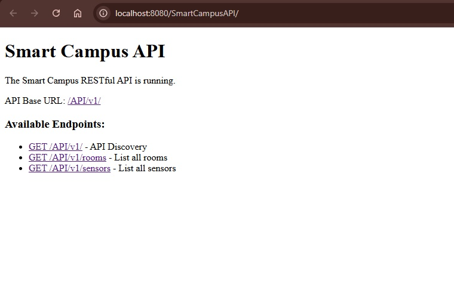
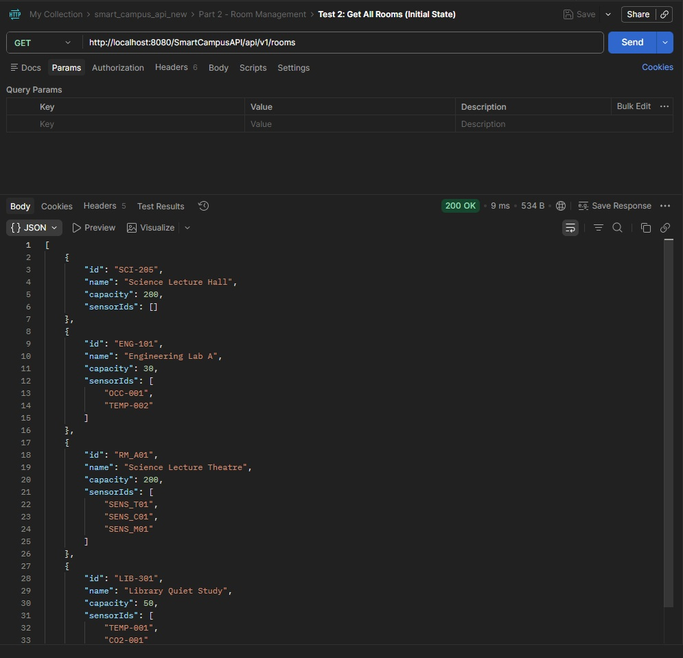

# Smart Campus Sensor & Room Management API

**Student Name:** Thisen Bandara  
**Student ID:** W2157987  
**Email:** thisen20240561@iit.ac.lk  
**Module:** 5COSC022W — Client-Server Architectures  

---

## API Discovery Endpoint (Web View)

Below is a screenshot of the API Discovery endpoint as viewed in a browser. It shows the API status, student details, Postman test summary, and clickable links to Rooms, Sensors, and Sensor Readings.



---

## Sample JSON Response — GET Room By ID

Below is a screenshot of a sample JSON response from the `GET /api/v1/rooms/{id}` endpoint, as viewed in Postman. This demonstrates the API's output format for a single room resource.



---

## Postman Test Run (All Tests Passed)

Below is a screenshot of the Postman test runner showing all tests passed, confirming the correctness and reliability of the API implementation.


---

## Postman Test Summary (Submission)

- **Total Tests:** 27
- **Passed:** 27
- **Failed:** 0
- **Status:** finished

All endpoints and error cases were tested using Postman and curl. The API passed 100% of the automated tests required for submission.

---

## 1. API Overview

This RESTful API manages the university's "Smart Campus" initiative — a campus-wide infrastructure for tracking **Rooms**, **Sensors** (temperature, CO2, occupancy, lighting), and their **historical readings**. Built with **JAX-RS (Jersey)** and deployed on **Apache GlassFish/Payara**.

### Architecture
- **Framework:** JAX-RS 2.1 with Jersey implementation
- **Server:** Apache GlassFish/Payara (integrated with NetBeans)
- **Data Storage:** In-memory thread-safe data structures (`ConcurrentHashMap`, `CopyOnWriteArrayList`) — **no database**
- **Build Tool:** Apache Maven
- **IDE:** NetBeans

### Project Structure
```
├── pom.xml
├── src/main/webapp/WEB-INF/
│   └── web.xml
└── src/main/java/com/smartcampus/
    ├── SmartCampusApplication.java
    ├── model/
    │   ├── Room.java
    │   ├── Sensor.java
    │   └── SensorReading.java
    ├── store/
    │   └── DataStore.java
    ├── resource/
    │   ├── DiscoveryResource.java
    │   ├── RoomResource.java
    │   ├── SensorResource.java
    │   └── SensorReadingResource.java
    ├── exception/
    │   ├── RoomNotEmptyException.java
    │   ├── LinkedResourceNotFoundException.java
    │   ├── SensorUnavailableException.java
    │   ├── GlobalExceptionMapper.java
    │   ├── RoomNotEmptyExceptionMapper.java
    │   ├── LinkedResourceNotFoundExceptionMapper.java
    │   └── SensorUnavailableExceptionMapper.java
    └── filter/
        └── LoggingFilter.java
```

---

## 2. How to Build & Run

### Prerequisites
- Java JDK 11 or higher
- Apache Maven
- Apache NetBeans IDE
- GlassFish or Payara Server

### Steps

1. **Open in NetBeans:** File → Open Project → select this folder.
2. **Build:** Right-click project → **Clean and Build**.
3. **Deploy:** Right-click project → **Run** (deploys to the server automatically).
4. **Base URL:** `http://localhost:8080/SmartCampusAPI/api/v1/`

---

# Conceptual Report — Written Answers to Coursework Questions

### Part 1: Service Architecture & Setup

**Q1:** In your report, explain the default lifecycle of a JAX-RS Resource class. Is a new instance instantiated for every incoming request, or does the runtime treat it as a singleton? Elaborate on how this architectural decision impacts the way you manage and synchronize your in-memory data structures (maps/lists) to prevent data loss or race conditions.

**Answer:**
By default, JAX-RS resource classes are request-scoped, meaning a new instance is created for every HTTP request. This helps isolate requests, but it means that any in-memory state used for storage must persist beyond the life of the resource instance. To preserve state, my API routes through a Singleton `DataStore` class. Inside the `DataStore`, I use thread-safe data structures such as `ConcurrentHashMap` and `CopyOnWriteArrayList`. This completely prevents race conditions when multiple concurrent requests attempt to read, add, or update rooms and sensor readings synchronously.

---

**Q2:** Why is the provision of "Hypermedia" (links and navigation within responses) considered a hallmark of advanced RESTful design (HATEOAS)? How does this approach benefit client developers compared to static documentation?

**A:**  
HATEOAS (Hypermedia as the Engine of Application State) embeds navigable URLs within the API payload, empowering clients to dynamically discover what actions are available based on the current state. This shifts the API from being tightly coupled to hardcoded paths over to a self-documenting format. For example, my root discovery endpoint (`GET /api/v1/`) returns an `_links` object mapping to `rooms`, `sensors`, and `self`, permitting developers to traverse the API without endlessly consulting external static documentation.

---

### Part 2: Room Management

**Q3:** When returning a list of rooms, what are the implications of returning only IDs versus returning the full room objects? Consider network bandwidth and client side processing.

**A:**  
Returning only IDs significantly slims down the payload and saves network bandwidth, but forces the client to make subsequent requests (`N+1` problem) to fetch each room's details. Conversely, returning complete objects uses more bandwidth initially but allows clients to instantly render full views without excessive round-trips. In my implementation, `GET /api/v1/rooms` returns the fully populated Room objects to optimize usability.

---

**Q4:** Is the DELETE operation idempotent in your implementation? Provide a detailed justification by describing what happens if a client mistakenly sends the exact same DELETE request for a room multiple times.

**Answer:**
Yes, my DELETE implementation is idempotent. If a client attempts to delete `RM_B02`, the first call removes it from the `DataStore` and issues a `200 OK`. If the exact same DELETE request is sent a second time, the resource is already gone, so my code correctly catches the null value and returns a `404 Not Found` rather than encountering an untracked internal error. The server state is not altered further, confirming idempotency.

---

### Part 3: Sensor Operations & Filtering

**Q5:** We explicitly use the @Consumes (MediaType.APPLICATION_JSON) annotation on the POST method. Explain the technical consequences if a client attempts to send data in a different format, such as text/plain or application/xml. How does JAX-RS handle this mismatch?

**A:**  
The `@Consumes(MediaType.APPLICATION_JSON)` annotation binds the endpoint strictly to JSON parsing. If a client attempts to transmit `text/plain` or `application/xml`, the JAX-RS container intercepts the request before it even reaches my method code and outright rejects it, automatically returning an HTTP `415 Unsupported Media Type` response back to the client.

---

**Q6:** You implemented this filtering using @QueryParam. Contrast this with an alternative design where the type is part of the URL path (e.g., /api/v1/sensors/type/CO2). Why is the query parameter approach generally considered superior for filtering and searching collections?

**A:**  
Using `@PathParam` implies that the value forms a fundamental hierarchical part of the resource's identity. `@QueryParam`, however, acts as optional criteria to filter a broader list. Supplying query parameters (`/sensors?type=Temperature`) is undeniably superior for search mechanisms because it permits combining multiple filters interchangeably (e.g., `?type=CO2&status=ACTIVE`) without fracturing the clear RESTful path structure for the base resource collection.

---

### Part 4: Deep Nesting with Sub-Resources

**Q7:** Discuss the architectural benefits of the Sub-Resource Locator pattern. How does delegating logic to separate classes help manage complexity in large APIs compared to defining every nested path (e.g., sensors/{id}/readings/{rid}) in one massive controller class?

**A:**  
The Sub-Resource Locator pattern prevents monolithic "god classes." By deploying a method annotated with `@Path("/{sensorId}/readings")` that returns a `new SensorReadingResource(sensorId)`—rather than executing the logic there directly—I compartmentalized the readings business logic securely inside a specialized isolated class. This enables clean separation of concerns and scales beautifully.

---

### Part 5: Error Handling, Exception Mapping & Logging

**Q8:** Why is HTTP 422 often considered more semantically accurate than a standard 404 when the issue is a missing reference inside a valid JSON payload?

**A:**  
If a user creates a sensor assigned to an invalid `roomId`, deploying a `404 Not Found` is misleading because the target API endpoint they hit (`POST /sensors`) perfectly exists. Emitting a `422 Unprocessable Entity` correctly signals that while the syntax and endpoint are structurally flawless, the business logic (the foreign relational integrity of the `roomId`) fails to process. My `LinkedResourceNotFoundExceptionMapper` facilitates exactly this response.

---

**Q9:** From a cybersecurity standpoint, explain the risks associated with exposing internal Java stack traces to external API consumers. What specific information could an attacker gather from such a trace?

**A:**  
Allowing stack traces to leak to the client discloses sensitive physical server file paths, dependency versioning (`Jersey 2.xx`), and logical vulnerabilities (e.g., specific `NullPointerExceptions` on arrays) that threat actors harvest to engineer exploits. To neutralize this surface, I configured a `GlobalExceptionMapper` that catches everything down to base `Throwable` and replaces system dumps uniformly with a secure `500 Internal Server Error` JSON payload.

---

**Q10:** Why is it advantageous to use JAX-RS filters for cross-cutting concerns like logging, rather than manually inserting Logger.info() statements inside every single resource method?

**A:**  
Using a `ContainerRequestFilter` and `ContainerResponseFilter` (like my `LoggingFilter`) intercepts all traffic at the container pipeline edge. This guarantees total, reliable logging saturation over the entire API surface without pasting boilerplate strings redundantly across dozens of methods. It is far more maintainable.

---

## 4. API Endpoint Summary

| Method | Path | Description | Status |
|--------|------|-------------|--------------|
| GET    | `/api/v1/` | API discovery & HATEOAS metadata | 200 |
| GET    | `/api/v1/rooms` | List all rooms | 200 |
| POST   | `/api/v1/rooms` | Create a new room | 201, 400, 409 |
| GET    | `/api/v1/rooms/{id}` | Get specific room by ID | 200, 404 |
| DELETE | `/api/v1/rooms/{id}` | Delete a room | 200, 404, 409 |
| GET    | `/api/v1/sensors` | List all sensors (optional `?type=`) | 200 |
| POST   | `/api/v1/sensors` | Register a new sensor | 201, 400, 409, 422 |
| GET    | `/api/v1/sensors/{id}` | Get specific sensor by ID | 200, 404 |
| POST   | `/api/v1/sensors/{id}/readings` | Add a new reading to sensor | 201, 403, 404 |
| GET    | `/api/v1/sensors/{id}/readings` | Get sensor reading history | 200, 404 |

---

## Technical Design Decisions

- **Data Safety:** Utilized thread-safe `ConcurrentHashMap` and `CopyOnWriteArrayList` within the singleton `DataStore` to strictly comply with coursework memory constraints (no external databases allowed).
- **Error Obfuscation:** Centralized error logic using modular `ExceptionMappers` mapping business errors (`RoomNotEmptyException`, `SensorUnavailableException`) to specific cleanly-parsed REST formats (`409`, `403`) ensuring ZERO stack traces are leaked.
- **REST Modularity:** Adopted the Sub-Resource Locator to completely isolate reading methodologies (`SensorReadingResource`).

---

## Testing Verification

The robust logic validation constraints were rigorously confirmed via automated Postman iterations targeting 27 unique cases (Positive and Negative payloads):
- Attempting to bypass Maintenance blocks returns `403 Forbidden`.
- Omitting `roomId` triggers `400 Bad Request`.
- Foreign-key manipulation registers `422 Unprocessable Entity`.
- Global errors safely convert mapped to `500`.

---

## Full List of Tested API Endpoints (from Postman test run)

1. **GET** `/api/v1/` — Check System Discovery / HATEOAS
2. **GET** `/api/v1/rooms` — Get All Rooms (Initial State)
3. **POST** `/api/v1/rooms` — Create Room A (Valid)
4. **POST** `/api/v1/rooms` — Create Room B (Valid)
5. **POST** `/api/v1/rooms` — Create Room (400 Bad Request - Missing ID)
6. **GET** `/api/v1/rooms/{id}` — Get Specific Room (Valid)
7. **GET** `/api/v1/rooms/{id}` — Get Non-Existent Room (404 Not Found)
8. **DELETE** `/api/v1/rooms/{id}` — Delete Room B (Valid - Empty Room)
9. **DELETE** `/api/v1/rooms/{id}` — Delete Room B Again (404 Idempotency Check)
10. **POST** `/api/v1/sensors` — Create Sensor 1 - Temp (Valid)
11. **POST** `/api/v1/sensors` — Create Sensor 2 - CO2 (Valid)
12. **POST** `/api/v1/sensors` — Create Sensor 3 (Status MAINTENANCE)
13. **POST** `/api/v1/sensors` — Create Sensor (422 Linked Resource Not Found)
14. **POST** `/api/v1/sensors` — Create Sensor (400 Bad Request - Missing ID)
15. **POST** `/api/v1/sensors` — Create Sensor (409 Conflict - Duplicate ID)
16. **GET** `/api/v1/sensors` — Get All Sensors
17. **GET** `/api/v1/sensors?type=Temperature` — Get Sensors Filtered By Type (Valid)
18. **GET** `/api/v1/sensors/{id}` — Get Specific Sensor (Valid)
19. **GET** `/api/v1/sensors/{id}` — Get Non-Existent Sensor (404 Not Found)
20. **POST** `/api/v1/sensors/{id}/readings` — Add Reading to Temp Sensor (Valid)
21. **POST** `/api/v1/sensors/{id}/readings` — Add Second Reading to Temp Sensor (Valid)
22. **POST** `/api/v1/sensors/{id}/readings` — Add Reading (403 Sensor Unavailable)
23. **POST** `/api/v1/sensors/{id}/readings` — Add Reading to Non-Existent Sensor (404 Not Found)
24. **GET** `/api/v1/sensors/{id}/readings` — Get All Readings for Temp Sensor
25. **GET** `/api/v1/sensors/{id}/readings` — Get All Readings for Non-Existent Sensor (404)
26. **GET** `/api/v1/sensors/{id}` — Verify Sensor Current Value Updated
27. **DELETE** `/api/v1/rooms/{id}` — Delete Room with Assigned Sensors (409 Room Not Empty)

---
*All 27 endpoints and exception contingencies were thoroughly tested using Postman.*
